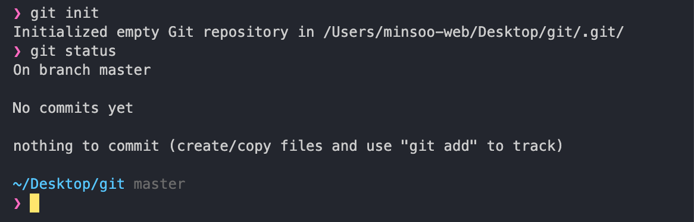
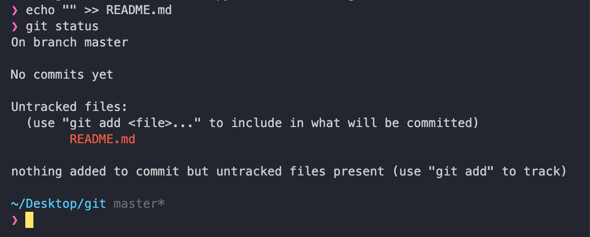
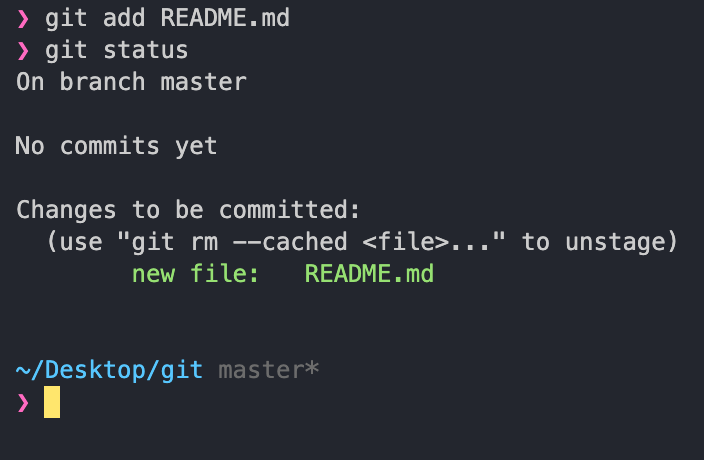
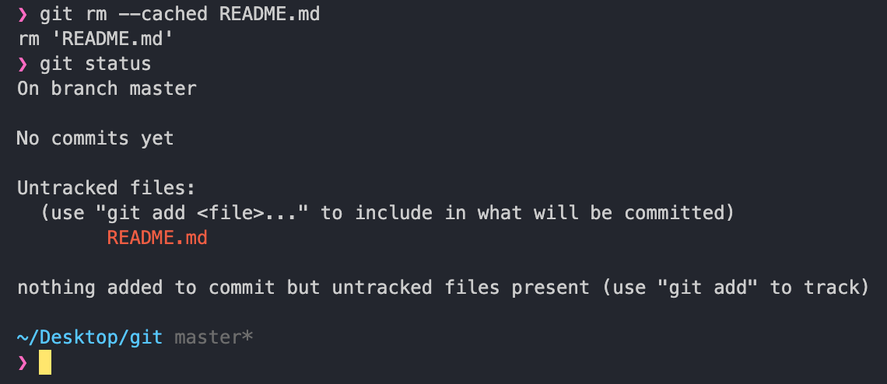
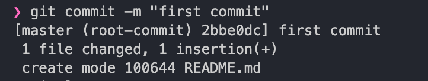
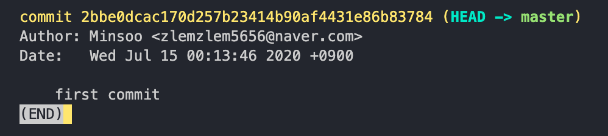

# add_commit

이 곳에서는 수정한 코드를 원격 저장소에 올리는 방법을 단계별로 저장해 놓았습니다.

## 00. 코드 수정

git init을 통해 로컬 깃 저장소안에 있는 파일을 수정하게 되면  
git이 자동으로 어떤 부분이 어떻게 수정되었는지를 추적해줍니다.

파일 수정을 하기 전

파일 수정을 하고 난 뒤 (`README.md` 를 생성한 모습)

`git status` 명령어를 통해  
현재 로컬 디렉토리의 파일 상태를 추적해볼 수 있다.

## 01. staging

커밋을 하기 위해서는 `staging` 이라는 단계가 필수적이다.

`git add` 명령어를 실행하기 전까지의 변경사항들은 working directory 에서만 관리되고 휘발성입니다.

그 휘발성인 변경사항들을 스냅샷을 찍기 위한 준비 단계인 staging area로 넘겨주는 명령어가 바로 `git add` 이며 사용 방법은 크게 두 가지입니다.

### 명시적 추가

`git add <파일이름>`

`commit`이라는 명령어를 바로 다음에 배우겠지만 `commit`은 지금 스테이징이 되어 있는 `staging area`의 변경사항들을 한꺼번에 처리하는 명령어이기 때문에  
`commit`을 하기 위한 변경사항들만 따로 처리해야 할 필요가 있습니다.

그렇기 때문에 공통된 변경 사항들만 따로 따로 모아야 할때 파일 이름을 일일이 명시해서 `staging area`에 추가해줘야 할 때 사용되는 방법입니다.

### 전체 변경사항을 추가

`git add .` 또는 `git add -A`

현재 working directory의 변경사항들이 딱히 구별할 필요가 없는 공통된 변경사항이라면 git add 명령어를 통해 하나하나 추가해줄 필요가 없겠죠?  
그럴때 사용되는 명령어가 `git add .` 또는 `git add -A` 입니다.

### staging 취소

만약 실수로 다른 파일들을 함께 staging 해버렸다면 이는 어떻게 해야 할까요?  
`git add` 명령어를 수행한 뒤 `git status` 명령어를 실행시켜 보겠습니다.

번역을 차근차근 해보니
`commit` 되어야할 변경사항이 있다고 알려주고

추가로 `unstage`를 하려면  
`git rm --cached <file>` 을 사용하라고 하네요

`unstage`를 해보고 다시 git status를 해보겠습니다.

다시 추적되지 않는 파일이 있다고 뜨면서 `git add` 명령어를 현기증 나기전에 실행시켜달라고 하죠?

## 02. commit

그럼 대체 commit (이하 커밋)이 대체 뭐길레 아니 git은 왜 사용하는 것이길레  
이런 복잡한 과정을 거쳐야 하며 따로 파일을 저장하는 것일까요?

이 일련의 과정을 `기억한다`라고 표현하면 이해가 빠르실까요?

git의 다른 이름은 형상관리 툴 (SVN = subversion) 또는 버전관리 프로그램이라고 불립니다.

혹자는 git을 통해 시간여행을 할 수 있다고 비유하여 설명하는데 정확히는 시간의 개념에 국한되지 않고  
버전을 자유롭게 이동한다라고 생각하셔야 이해하는데 오해가 없을 것 같습니다.

저희의 로컬 디렉토리는 git 저장소가 되는 순간부터  
매순간순간을 git에 의해 감시 당합니다.

하지만 감시만 당할뿐 git 은 그 변경사항들을 기억하고 있지 않습니다.  
`워킹디렉토리`는 휘발성이기 때문이죠

그 휘발성인 변경사항들을 메세지와 함께 id를 부여해서  
그 상태를(버전을) 기억할 수 있게 스냅샷을 찍어주는 명령어가  
`git commit` 입니다.

`git commit` 에는 많은 옵션들이 들어갈 수 있지만 가장 흔하고 꼭 필요한 옵션인 `-m`을 통해서 저희는 커밋에 `커밋 메세지`라는 것을 남길 수 있습니다.

폴라로이드 사진 밑에 언제 누구와 함께를 적듯이,  
저희가 찍은 스냅샷이 어떤 의미가 있는 버전이며 어떻게 구분되어 인식될지를 적는 것이 바로  
`커밋메세지` 입니다.

이러한 commit 메세지 및 커밋 이력들을 볼 수 있는 명령어가 바로 `git log`입니다.  
실습을 해보면서 `git commit`을 마무리 짓겠습니다.

`git commit -m "first commit"`

`git log`

