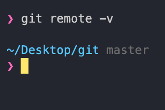
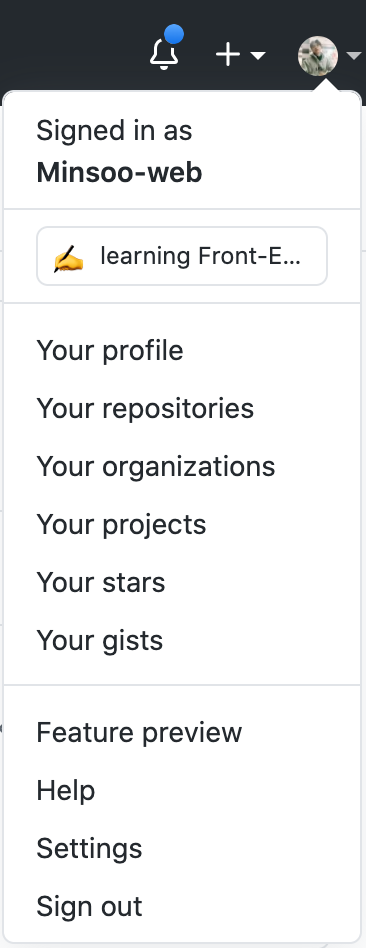
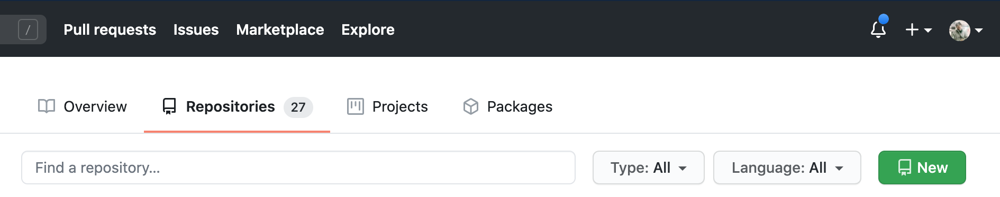
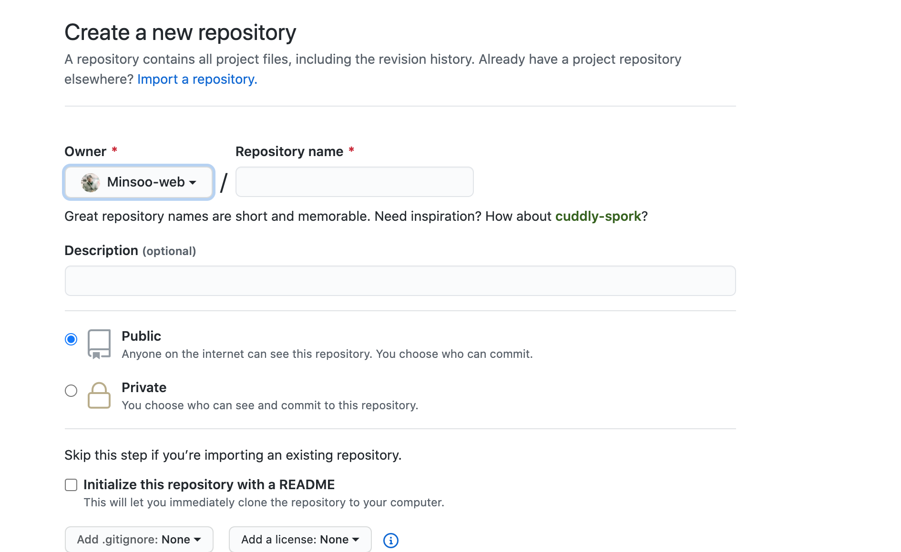
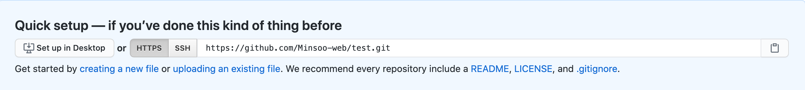
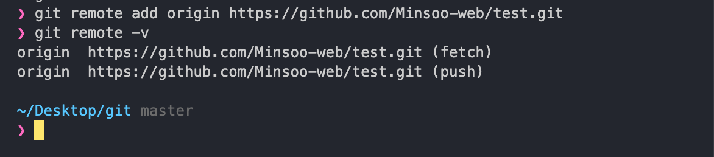
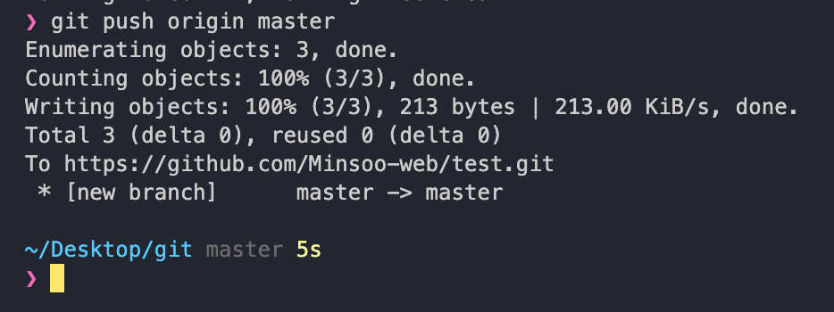
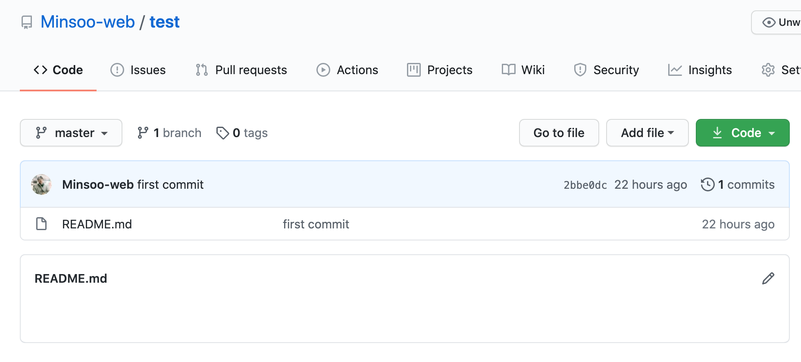

# remote add / push

이번에는 로컬에서 작업하던 저희 파일을 `원격 저장소`에 올려보겠습니다.  
흔히들 사용하는 네이버 클라우드나, 구글 드라이브처럼 git 레포지토리를 원격으로  
연동해서 원격 레포지토리에 자신의 파일을 저장하고 불러오고 할 수 있습니다.

그것을 가능하게 해주는 많은 서비스중 가장 유명하면서 저희가 사용해볼 서비스가  
바로 `GitHub` 입니다.

지금부터 저희가 해볼 것은

1. 로컬 레포지토리를 원격 레포지토리와 연동하기
2. 원격 레포지토리에 자신의 코드를 저장하기

## git remote

원격 저장소를 리모트 레포지토리라고 부릅니다. (단순 번역?)  
따라서 자신의 로컬 레포지토리를 원격 저장소에 연결하기 위해서는  
현재 자신의 로컬 레포지토리가 어떤 원격 저장소에 연결이 될것인지를 명시해주고  
연결을 해주어야 합니다.

다음 명령어를 쳐봅시다.

`git remote -v`

현재 연결된 remote 저장소가 하나도 없기 때문에 아무 반응이 없는 것이 정상입니다.

원격 저장소를 추가하는 manage 액션은 `add`입니다.  
뭔가 빠진 게 있는 것 같죠? 추가를 어떻게 하는 건 알겠는데 그 대상을 구하질 않았습니다.

github에 가입을 먼저 해주세요  
가입이 완료가 되셨다면 우측 상단에 작은 아바타가 보이실겁니다.

`Your repositories` 를 눌러주세요

우측 헤더에 보이는 초록색의 `New` 버튼을 눌러주세요

`Repository name`만 작성해주고 다른 건 그대로 놔두신 뒤에  
`create repositoriy` 버튼을 눌러주시면 됩니다.

여지껏 잘 따라오셨다면 이런 화면이 보이실 겁니다.  
저기 보이는 url을 그대로 복사하시면 (`.git` 까지 포함)  
github에서 해주어야 하는 것은 끝났습니다.

`git remote add origin 복사한URL`

이제 로컬디렉토리에서 터미널을 열어서 위와 같은 명령어를 입력해줍니다.

위와 같이 아무 반응이 없는 것이 정상입니다.  
이제 저희의 로컬 저장소는 origin이라는 이름의 원격 저장소와 연결이 되었습니다!  
제대로 연결이 되었는지 확인해보기 위해서는 `git remote -v` 를 통해 확인이 가능합니다.

위와 같이 두줄이 떳다면 성공입니다.  
이제 저희가 만들었던 README.md 파일을 원격 저장소에도 올려보겠습니다.

## git push

스포부터 해버렸습니다.

`git push 원격저장소이름 현재브랜치`

위와 같은 명령어를 통해 push를 할 수 있습니다.  
원격 저장소 이름은 `remote add` 명령어를 통해서 설명 드렸으며 브랜치의 개념은  
지금 배우기에는 조금 이르니 지금은 'master를 쓰는 자리구나' 라고만 알고 계시면 될 것 같습니다.

추가가 되었는지 확인하러 가보겠습니다.

정상적으로 추가가 되었습니다.
