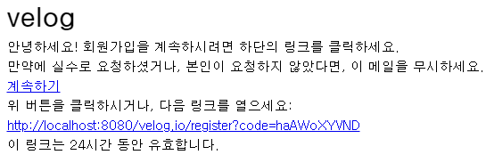
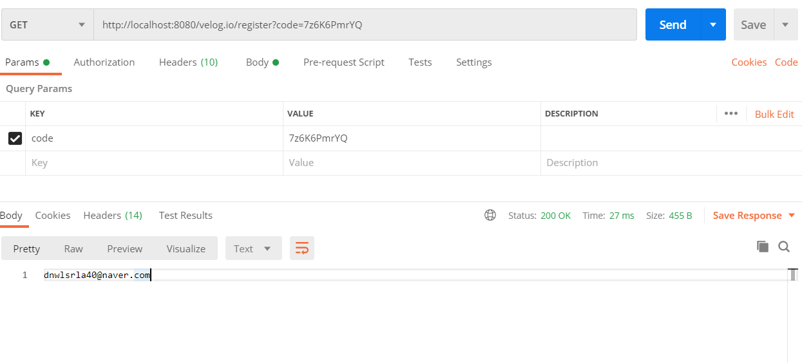

# API Reference

## DB Test data
- User.profile_links 타입 수정 전

 

## **User 설정 페이지**
- [No.2] profile_links 타입 수정 및 구현 전
- [No.2] thumbnail 구현 전
- 파라미터로 String 타입의 username을 사용했을 때 API Test를 통과하는 것을 확인했으나,  UUID로 수정 구현 후 UUID를 파라미터로 전달하는 방법을 찾지 못하여 테스트가 불가한 상황입니다. 해결 후에 API Test 스크린샷 첨부하겠습니다.

|No.|HTTP Method|API|Request (Front→Back)|Response (Back→Front)|비고|
|---|---|---|---|---|---|
|1|GET|/setting|User id|User 정보|-|
|2|PUT|/setting|User id thumbnail shortBio: 한 줄 소개 velogName: 벨로그 제목 profileLinks: 소셜 정보 * 수정되지 않은 항목은 기존 값 넣어서 보내줄 것|수정된 User 정보|-|
|3|DELETE|/setting|User id|탈퇴한 User id|-|

 
 

## **User 상세 페이지**
- [No.4] 구현 전

|No.|HTTP Method|API|Request (Front→Back)|Response (Back→Front)|비고|
|---|---|---|---|---|---|
|1|GET|/@{username}|tagname: '태그목록'에서 선택된 태그의 이름|(tagname==null) User 정보, User의 모든 글 (tagname!=null) User 정보, User의 글 중 해당 태그를 가진 글|내 벨로그 글 탭|
|2|GET|/@{username}/about|-|User 정보|내 벨로그 소개 탭|
|3|PUT|/@{username}/about|작성된 소개글|User 정보|내 벨로그 소개 탭|
|4|GET|/@username/series|||내 벨로그 시리즈 탭|

 

▲ [No.1]

▲ [No.2]

▲ [No.3]

 
 

## **Tag 관련 페이지**

|No.|HTTP Method|API|Request (Front→Back)|Response (Back→Front)|비고|
|---|---|---|---|---|---|
|1|GET|/tags|-|tag 목록 { tagName: tag 이름, postCnt: 포스트 개수 }|-|
|2|GET|/tags/{tagname}|선택된 태그 이름|해당 태그를 가진 포스트들 해당 태그를 가진 포스트 개수|-|

 

▲ [No.1]

▲ [No.2]

 
 

## **User 회원가입 페이지**

- 모든 API앞에 /velog.io 붙임

|No.|HTTP Method|API|Request (Front→Back)|Response (Back→Front)|비고|
|---|---|---|---|---|---|
|1|Post|/register-mail|email|-|회원가입 mail 전송|
|2|Get|/register|code|email|url은 mail에 같이 전송   회원가입 페이지로 이동   Front는 사용하지 않는 API|
|3|Post|/register|User 정보|Token 객체(accessToken, refreshToken)|velog에서 회원가입 성공 후 바로 로그인 되어 메인페이지로 이동|

 

  
▲ [No.1] 전송된 email

▲ [No.2]

▲ [No.3]

 
 

## **User 로그인 페이지**

- 모든 API앞에 /velog.io 붙임

|No.|HTTP Method|API|Request (Front→Back)|Response (Back→Front)|비고|
|---|---|---|---|---|---|
|1|Post|/login-mail|email|-|로그인 mail 전송|
|2|GET|/email-login|code|Token 객체(accessToken, refreshToken)|-|

 

  
▲ [No.1] 전송된 email

▲ [No.2]