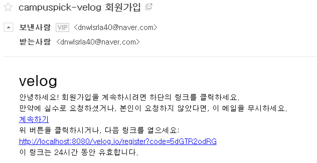

# Backend Test 환경 구성

## 환경 설정

JDK : openJDK 13(JDK 8이하만 아니면 호환될 것입니다.)
JPA(DB) : SPA가 Database에 접근해야 하므로 Mysql도 설치하셔야 할겁니다.

## intellij 무료 버전 설치

Backend Tool인 intellij를 설치하여야 합니다. intellij는 Ultimate 버전을 사용하려면 돈을 지불해야하므로 학생 계정을 통한 무료 설치를 진행하셔야 합니다.

링크 : [intellij 무료버전 설치](https://goddaehee.tistory.com/215)

## Github 프로젝트를 intellij에 import(Clone)

intellij에 github 프로젝트를 clone하는 방법입니다.
링크 글 중 "(3)intellij를 이용한 Clone" 부분을 따라하시면 됩니다.

링크 : [intellij import](https://secuinfo.tistory.com/entry/Intellij-Github-Link)

## import 한 project 실행

src/main/resource/application.properties에 DB 접근을 위한 정보를 적어줍니다.

```
# MySQL 설정
spring.datasource.url=jdbc:mysql://localhost:3306/db이름?useSSL=false&characterEncoding=UTF-8&serverTimezone=UTC&allowPublicKeyRetrieval=true
spring.datasource.username=mysql 계정 번호(보통 root)
spring.datasource.password=mysql 비밀번호
spring.datasource.driver-class-name=com.mysql.cj.jdbc.Driver
```

추가로 아래 설정도 적어줍니다.
```
# SQL문 콘솔에 출력
spring.jpa.show-sql=true
# InnoDB 엔진 설정
spring.jpa.database-platform=org.hibernate.dialect.MySQL5InnoDBDialect
# DDL 사용 옵션(실제 개발 시 예상치 못한 DB 변경을 막기 위해 false로 설정해야 함)
spring.jpa.generate-ddl=true
spring.jpa.hibernate.ddl-auto=update

# 새로운 ID 생성 옵션(MySQL의 Auto Increment 속성을 사용하기 위해 false로 설정)
spring.jpa.hibernate.use-new-id-generator-mappings=false

# MailSender 설정
spring.mail.host=smtp.naver.com
spring.mail.port=587
spring.mail.username= mail 보낼 사람 email
spring.mail.password=
spring.mail.properties.mail.smtp.auth=true
spring.mail.properties.mail.smtp.starttls.enable=true

# Redis 설정
spring.cache.type=redis
spring.redis.host=localhost
spring.redis.port=6379

# Jwt 설정
jwt.secret=secret Key 값
jwt.access.header=access_token
jwt.refresh.header=refresh_token
```

설정을 다하셨으면 아래 사진의 버튼을 눌러 서버를 열고 postman등을 이용하여 test합니다.


## docker 설치

window 10버전에 docker를 설치하는 방법입니다.
아래 링크를 따라서 docker를 설치해 줍니다.

Docker는 window edu 이상에서 동작가능하므로, window edu, pro가 아니라면
Linux 혹은 VM 환경에서 설치해주셔야 합니다.

링크 : [intellij import](https://secuinfo.tistory.com/entry/Intellij-Github-Link)

## docker에 redis 설치

DockerFile이나 redis 설정파일 등으로 하셔도 되지만 최대한 간단히 설명하기 위해 사용하지 않았습니다.

```
docker pull redis
```
로 redis를 설치합니다.

```
docker images
```
로 생성된 image를 볼 수 있습니다.

```
docker ps
```
로 생성된 container를 볼 수 있습니다.

redis가 설치되었다면,

```
docker run -p 6379:6379 --name [컨테이너 이름] -d [이미지 이름]

ex)
docker run -p 6379:6379 --name test-redis -d redis
```
로 레디스를 도커에 실행시킵니다.

실행중인 redis에 접속하기위해 아래 명령어를 칩니다.

```
docker exec -i -t [컨테이너 이름] redis-cli
```

접속이 되었다면
```
127.0.0.1:6379>
```
와 같은 화면이 뜰 것이고 거기에서 redis 명령어를 사용하면 됩니다.

(API test에선 사용할 필욘 없고 redis 실행 및 접속만 해주세요.)

## Test할 API List 및 방법

### **회원가입 Test(회원가입이 성공하면 로그인 로직으로 넘어가므로 회원가입만 Test 해보셔도 될 것 같습니다.)**

</br>

1. [No.1] POST "/register-mail" API Test

|HTTP Method|API|Request (Front→Back)|Response (Back→Front)|비고|
|---|---|---|---|---|
|Post|/register-mail|email|-|회원가입 mail 전송|
</br>

 

</br>

2. 이메일이 재대로 전송되었는지 확인

 

</br>

3. [No.2] GET "/register" API test

회원가입 링크 작동 확인

|HTTP Method|API|Request (Front→Back)|Response (Back→Front)|비고|
|---|---|---|---|---|
|GET|/register|code|email|url은 mail에 같이 전송 </br> 회원가입 페이지로 이동 </br> Front는 사용하지 않는 API|
</br>

 


4. [No.3] POST "/register" API test

|HTTP Method|API|Request (Front→Back)|Response (Back→Front)|비고|
|---|---|---|---|---|
|Post|/register|User 정보|Token 객체(accessToken, refreshToken)|velog에서 회원가입 성공 후 바로 로그인 되어 메인페이지로 이동|

 

5. DB에 User 정보 등록 확인

 

6. 주어진 Token으로 user 권한이 필요한 api 요청 (header에 access_token : token 값 넣고 요청)

 