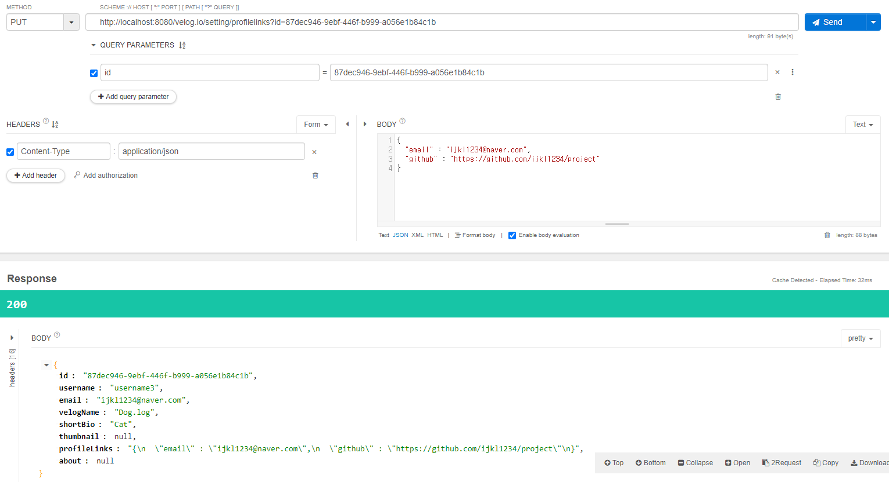
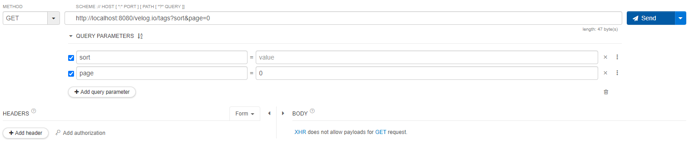

# REST API Reference

## 개발 진행 사항

1. 내 벨로그 페이지
    - 글 탭
        - [완료] GET velog.io/@{username} : 태그 목록에서 선택된 태그를 가진 글만 가져오기
        - [미완] 작성 순으로 정렬되고 있는지 확인 및 추가 구현 필요
        - [미완] 글 탭 내 검색 기능
    - 소개 탭
        - [완료] GET velog.io/@{username}/about : 소개글 가져오기
        - [완료] PUT velog.io/@{username}/about : 소개글 수정하기
    - 시리즈 탭
        - [완료] GET velog.io/@{username}/series : 시리즈 목록 가져오기
        - [완료] GET velog.io/@{username}/series/{seriesUrl} : 시리즈 상세 가져오기
        - [미완] 오름차순/내림차순 정렬 추가 구현 필요
        - [미완] PUT velog.io/@{username}/series/{seriesUrl} : 시리즈 수정하기
        - [미완] DELETE velog.io/@{username}/series/{seriesUrl} : 시리즈 삭제하기
1. 설정 페이지
    - [완료] GET velog.io/setting : User 정보 가져오기
    - [완료] PUT velog.io/setting/shortbio : 한 줄 소개 수정하기
    - [완료] PUT velog.io/setting/velogname : 벨로그 제목 수정하기
    - [완료] PUT velog.io/setting/profilelinks : 소셜 정보 수정하기
    - [미완] PUT velog.io/setting/thumbnail : 썸네일 수정하기
    - [미완] DELETE velog.io/setting/thumbnail : 썸네일 삭제하기
    - [미완] DELETE velog.io/setting : 회원 탈퇴 시 User 정보가 테이블에서 아예 삭제되도록 구현되어 있어서 수정 필요
1. 태그 목록 페이지
    - [완료] GET velog.io/tags : 인기순/이름순 정렬과 페이징(size 40) 적용하여 태그 목록 가져오기
1. 태그 상세 페이지
    - [완료] GET velog.io/tags/{tagName} : 해당 태그를 가진 글 리스트와 글 개수 가져오기
    - [미완] 작성 순으로 정렬되고 있는지 확인 및 추가 구현 필요
1. 게시글 상세 페이지
    - [완료] GET velog.io/@{username}/{postUrl} : 게시글 및 관련 정보(User, Comment 등) 가져오기
    - [완료] GET velog.io/comment : 개발 시 테스트의 편의를 위해 구현해놓음
    - [완료] POST velog.io/comment : 댓글 작성
    - [완료] PUT velog.io/comment : 댓글 수정
    - [미완] DELETE velog.io/comment : 댓글 삭제
    - [미완] PUT velog.io/@{username}/{postUrl} : 게시글 수정
    - [미완] DELETE velog.io/@{username}/{postUrl} : 게시글 삭제
    - [미완] 좋아요 기능
    - [미완] 공유 기능
    - [미완] 이전글/다음글 어떻게 구현할 지 확인 필요
1. 그 외 더 구현해야 할 것
    - 토큰을 통해 User 정보를 얻는 방식으로 전면 변경 필요

1. 게시글 작성 페이지
    - [완료] POST velog.io/write
        - [완료] 게시글 title, body(= not null) 속성 가진 것만 주는 경우
        - [완료] 게시글 series 만 있는 경우
        - [완료] 게시글 series + tagList 1개
        - [완료] 게시글 series + tagList 여러개 

1. 임시 게시글 페이지

1. 회원가입

1. 로그인

## API TEST

1. 내 벨로그 페이지 - 글 탭
    - [GET] velog.io/@{username}
        - 태그 목록에서 선택된 태그를 가진 글만 가져오기
        - @PathVariable String username : 토큰 이용하는 방식으로 변경 예정
        - @RequestParam String tagname : 태그 목록에서 선택된 태그 이름
        - Return : User, PostTag 리스트(선택된 태그 이름을 가진 글 리스트)

        
        
        ▲ 태그 목록에서 선택된 것이 "전체보기"일 경우 tagname을 파라미터로 전달하지 않는다.

        
        
        ▲ 태그 목록에서 선택된 것이 "전체보기"가 아닐 경우 tagname을 파라미터로 전달한다.

2. 내 벨로그 페이지 - 소개 탭
    - [GET] velog.io/@{username}/about
        - 소개글 가져오기
        - @PathVariable String username : 토큰 이용하는 방식으로 변경 예정
        - Return : User

        

    - [PUT] velog.io/@{username}/about
        - 소개글 수정하기
        - @PathVariable String username : 토큰 이용하는 방식으로 변경 예정
        - @RequestBody String about : 소개글 수정 내용
        - Return : User

        

3. 내 벨로그 페이지 - 시리즈 탭
    - [GET] velog.io/@{username}/series
        - 시리즈 목록 가져오기
        - @PathVariable String username : 토큰 이용하는 방식으로 변경 예정
        - Return : 시리즈 리스트

        
    
    - [GET] velog.io/@{username}/series/{seriesUrl}
        - 시리즈 상세 가져오기
        - @PathVariable String username : 토큰 이용하는 방식으로 변경 예정
        - @PathVariable String seriesUrl
        - Return : Series, Post 리스트

        

4. 설정 페이지
    - [GET] velog.io/setting
        - User 정보 가져오기
        - @RequestParam String id : 토큰 이용하는 방식으로 변경 예정
        - Return : User

        

    - [PUT] velog.io/setting/shortbio
        - 한 줄 소개 수정하기
        - @RequestParam String id : 토큰 이용하는 방식으로 변경 예정
        - @RequestBody String shortBio : 수정할 한 줄 소개
        - Return : User

        

    - [PUT] velog.io/setting/velogname
        - 벨로그 제목 수정하기
        - @RequestParam String id : 토큰 이용하는 방식으로 변경 예정
        - @RequestBody String velogName : 수정할 벨로그 제목
        - Return : User

        

    - [PUT] velog.io/setting/profilelinks
        - 소셜 정보 수정하기
        - @RequestParam String id : 토큰 이용하는 방식으로 변경 예정
        - @RequestBody String profileLinks : 수정할 소셜 정보 Json 형식으로 작성
        - Return : User

        

5. 태그 목록 페이지
    - [GET] velog.io/tags
        - 인기순/이름순 정렬과 페이징(size 40) 적용하여 태그 목록 가져오기
        - @RequestParam(defaultValue = "trending") String sort : trending(인기순) 또는 alphabetical(이름순)
        - @RequestParam int page : 페이징
        - Return : 태그 이름, 글 개수

        
        
        ▲ Trending

        
        
        ▲ Alphabetical

6. 태그 상세 페이지
    - [GET] velog.io/tags/{tagName}
        - 해당 태그를 가진 글 리스트와 글 개수 가져오기
        - @PathVariable String tagName : 태그 이름
        - Return : 글 리스트, 글 개수

        

7. 게시글 상세 페이지
    - [GET] velog.io/@{username}/{postUrl}
        - 게시글 및 관련 정보(User, Comment 등) 가져오기
        - @PathVariable String username : 토큰 이용하는 방식으로 변경 예정
        - @PathVariable String postUrl
        - Return : Post(User 정보 포함), Comment 리스트, Tag 리스트

        
        

    - [GET] velog.io/comment
        - 개발 시 테스트의 편의를 위해 구현해놓음
        - @RequestParam String postId
        - Return : 해당 글의 댓글 리스트

        

    - [POST] velog.io/comment
        - 댓글 작성
        - @RequestBody CommentRequestDto requestDto : 현재 포스트(UUID postId), 댓글 작성자(UUID userId), 댓글에 대한 답글인 경우 원댓글(UUID replyTo), 댓글 내용(String text)
        - Return : Comment

        

    - [PUT] velog.io/comment
        - 댓글 수정
        - @RequestParam String commentId
        - @RequestBody String text : 수정할 댓글 내용
        - Return : Comment

        

## User
| URL | Method | 기능 |
|---|---|---|
|/velog.io/regiter|GET|회원가입 페이지 이동 요청|
|/velog.io/email-login|GET|로그인 요청|
|/velog.io/register-mail|POST|회원가입 메일 전송 요청|
|/velog.io/login-mail|POST|로그인 메일 전송 요청|
|/velog.io/register|POST|회원가입 요청|

 

## Post

| URL | Method | 기능 |
|---|---|---|
|/velog.io/write|POST|게시글 등록 요청|
|/velog.io/thumbnail|POST|Thumbnail 업로드 요청|
|/velog.io/download|GET|Thumbnail 테스트 용|

 

## Series

| URL | Method | 기능 |
|---|---|---|
|/velog.io/series|POST|Series 추가 요청|

 

## PostHistory

| URL | Method | 기능 |
|---|---|---|
|/velog.io/saves|GET|임시저장글 요청|
|/velog.io/writes|GET|임시 게시글 detail 요청|
|/velog.io/saves|POST|임시 게시글 저장|

 