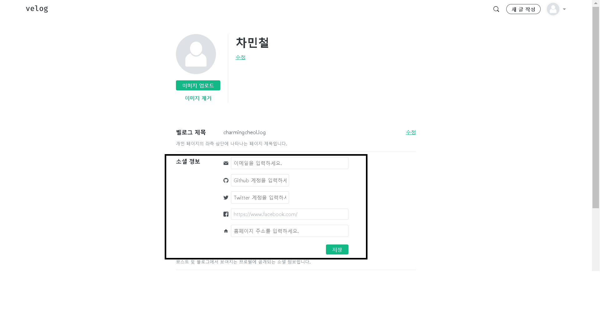
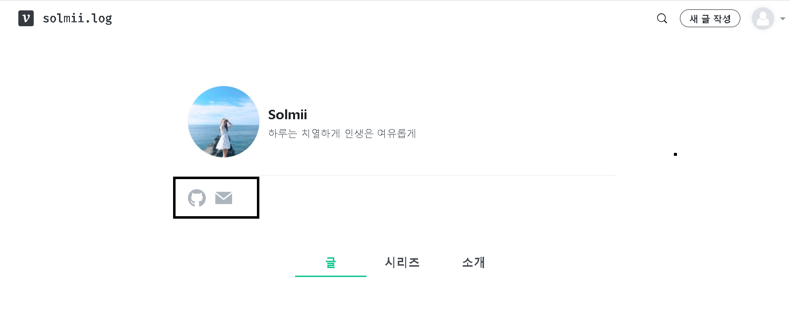

# front_200825

## [회의 진행 순서]

- 회의 진행 순서에 앞서, 프론트 인원 3명 모두 9월 이후에도 프로젝트 참여가 가능합니다.

1. 수정 사항
2. 서버 요청 사항
3. 담당 영역 배분
4. 차후 목표

## [수정 사항]

1. useInfiniteScroll Hooks 수정

   - 인피니트 스크롤링 방식을 Custom Hooks로 만들었으나, 정확한 원리와 동작과정에 대해 설명이 부족함을 인지
   - 해당 부분은 코드를 단순화하고, 주석으로 동작과정을 자세하게 작성하도록 수정 예정

2. 메인 페이지 게시글 grid 수정

   - 화면 배율을 축소 할 경우, 메인 페이지의 게시글 grid가 velog와 동일하게 동작하지 않음을 확인
   - 관련된 grid 배치 css를 수정할 예정

## [서버 요청 사항]

1. profile_links Type 문의

   - User Table에서 profile_links의 Type이 Blob임을 확인하였습니다. 그런데 Blob으로 이메일, 깃허브, 트위터, 페이스북과 같은 소셜 URL data을 어떻게 전달하는지 모호함을 느끼게 되었습니다.
   - 금일 프론트 회의 결과, profile_links을 각각 twitter_link, facebook_link, github_link, email_link, homepage_link로 분리할 수 있는지 문의 드립니다.
   - 대표적으로 profile_links data를 사용하는 화면은 아래와 같습니다.
     1. 설정 페이지 -> 소셜 정보
        
     2. 내 벨로그 페이지
        

## [담당 영역 배분]

1. 게시글 작성 페이지, 임시 글 페이지(민철님)

   - 마크다운을 이용해서 게시글 작성 구현
   - 게시글 작성 도중 임시저장을 할 경우, 임시 글 페이지에 추가되도록 구현

2. 읽기 목록 페이지, 게시글 상세 페이지 목차, 미구현 항목 체크 후 구현(주아님)

   - [좋아한 포스트], [최근 읽은 포스트] 탭으로 나눠서 게시글 리스트 랜더링 구현
   - 게시글 상세 페이지 우측 화면에 목차 부분을 누락했기 때문에 해당 부분을 구현
   - 미처 구현되지 못했던 항목이 있는지 체크한 후, 해당 항목이 있을 시 구현

3. 설정 페이지, 검색 페이지(현우님)

   - 현재 공유된 유저 프로필 설정 API를 기반으로 설정 페이지를 구현
   - 검색과 같은 경우 특정 단어 입력을 종료했을 때, 입력한 텍스트를 전송하기 위해 디바운스로 제어하도록 구현
   - 디바운스 : 연이어 호출되는 함수들 중 마지막 함수(또는 제일 처음)만 호출하도록 하는 것

## [차후 목표]

1. 담당 영역 마감일

   - 9월 9일까지 담당 영역 완료 예정

2. 차후 목표(9/9 ~ 9/30)

   - 코로나가 다시 완화되면, 서버 팀장님과 대면해서 JWT 로그인 방식 체크
   - 만약 9월 9일 전에 서버쪽 통신 준비가 완료될 경우, 더미 데이터를 전부 제거할 예정
   - 추가적인 보완이 필요한 영역, 진행 도중 누락했던 영역, 탐색적으로 페이지를 탐색하여 에러 발생 확인
   - 위 모든 과정을 9/30까지 진행하고 문제가 없을 경우, 프론트쪽 클론 프로젝트는 완료될 것으로 판단
